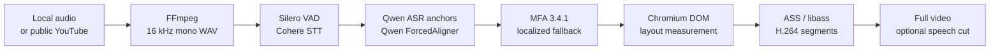

<p align="center">
  
</p>

<h1 align="center">podcast-align-video</h1>

<p align="center">
  <strong>Audio in. Word-aligned video out.</strong><br>
  Turn English audio or one public YouTube video into a precise, word-highlighted H.264 video—without recording a browser in real time.
</p>

<p align="center">
  <a href="https://github.com/alxs000000/podcast-align-video/actions/workflows/tests.yml"></a>
  <a href="https://github.com/alxs000000/podcast-align-video/releases/tag/v0.1.0"></a>
  <a href="LICENSE"></a>
  
  
</p>

<p align="center">
  
</p>

<p align="center">
  <sub>
    4.4-second demo from the <a href="https://groups.inf.ed.ac.uk/ami/corpus/">AMI Meeting Corpus</a>, CC BY 4.0.
    <a href="https://github.com/alxs000000/podcast-align-video/releases/download/v0.1.0/podcast-align-video-demo.mp4">Watch with sound</a> ·
    <a href="docs/DEMO.md">provenance and measurements</a>
  </sub>
</p>

## Why hybrid rendering?

Browser capture preserves web typography, but makes a five-hour recording take roughly five hours to render. Plain ASS rendering is fast, but cannot decide line wrapping exactly like the browser.

`podcast-align-video` combines both approaches:

1. Chromium lays out every sentence with the real subtitle HTML, CSS, and Geist font.
2. The pipeline records each word's measured rectangle and final font size.
3. ASS/libass redraws those measurements into validated 30-minute H.264 segments.

The result keeps the current DOM-designed look while rendering long audio far faster than real-time browser capture.

## Highlights

- **Two inputs:** any local audio FFmpeg can decode, or one login-free YouTube video.
- **Layered alignment:** Silero VAD → Cohere Transcribe → Qwen anchors and forced alignment → mandatory MFA refinement.
- **Localized fallback:** missing, unmatched, or conflicting MFA regions fall back to Qwen without discarding valid MFA boundaries elsewhere.
- **Durable long runs:** fingerprints, atomic writes, validated stage checkpoints, per-window STT resume, per-segment alignment resume, and reusable video segments.
- **Two useful outputs:** a canonical full video plus an optional version with configurable long silences removed.
- **Reproducible runtime:** pinned Python 3.12 environments, immutable model revisions, MFA 3.4.1, and a real `doctor` preflight.

## Quick start

v0.1 targets Linux or WSL2 with an NVIDIA CUDA GPU. Install FFmpeg/FFprobe with libass and libx264, a working NVIDIA driver, `curl`, `tar`, `bzip2`, and the shared libraries required by Playwright Chromium. The setup script never invokes `sudo`, `apt`, or another system package manager.

```bash
git clone https://github.com/alxs000000/podcast-align-video.git
cd podcast-align-video
./scripts/setup.sh
```

Cohere Transcribe is gated. Request and accept access on the [official model page](https://huggingface.co/CohereLabs/cohere-transcribe-03-2026), authenticate with your own Hugging Face token, then fetch the pinned models:

```bash
cp config/default.toml config/local.toml
podcast-align-video models fetch --config config/local.toml
podcast-align-video doctor --config config/local.toml
```

`models fetch` shows every model ID, immutable revision, model-card/license URL, and approximate size before downloading. It cannot accept terms for you. `run` never downloads a missing model and fails in preflight before expensive processing.

## Run

```bash
# Local audio
podcast-align-video run ./episode.flac --config config/local.toml

# One public, login-free YouTube video
podcast-align-video run 'https://www.youtube.com/watch?v=VIDEO_ID' --config config/local.toml

# Explicit destination and silence threshold
podcast-align-video run ./episode.wav \
  --output-dir ./my-output \
  --silence-threshold 7.5 \
  --device cuda:0
```

Without `--output-dir`, the result goes to `./outputs/<sanitized-title>-<fingerprint12>/`:

```text
video.mp4
video-speech-cut.mp4       # only when qualifying silence was removed
source.<original-extension>
transcript.txt
word-timings.json
run-manifest.json
run.log
```

Local input is copied byte-for-byte. YouTube audio is fetched again on every invocation and retains its downloaded codec; playlists, cookies, authenticated/private videos, and cache fallback are intentionally unsupported. Final video audio is encoded once as 48 kHz AAC at a requested 192 kbps.

The full video is canonical. Silence removal defaults to 5 seconds and protects aligned word-focus intervals. A no-cut run records `no_cuts`; a failure isolated to the optional speech-cut render returns the valid full video with a warning and exit status 0.

## Pipeline



The renderer defaults to 1920×1080 at 30 fps on a black background, with centered Geist text, a 76 px font ceiling, browser-measured wrapping, and a gold rounded active-word box. Its default encoder is `libx264 -preset veryfast -crf 20`; `h264_nvenc` and presets such as `p4` can be selected in TOML.

In one private acceptance run, the renderer produced a 5 h 04 min video in 23 min 59 sec on an RTX 4070 SUPER with NVENC `p4`—12.7× real time. This is a renderer-only observation, not a guaranteed end-to-end benchmark.

## Resume and cleanup

Stages are fingerprinted from input hashes, effective settings, immutable model revisions, and schema versions. Re-running the same input and configuration reuses only checkpoints whose artifacts still validate. An explicit output directory containing a different fingerprint is never overwritten.

```bash
# Dry run: show what would be removed
podcast-align-video clean JOB_ID

# Remove only that completed job's retained work
podcast-align-video clean JOB_ID --yes
```

`clean` never removes published artifacts or models. v0.1 deliberately has no process or GPU lock; do not run the same job or share one GPU between concurrent invocations.

## Python API

```python
from pathlib import Path

from podcast_align_video import RunConfig, run

result = run(
    "episode.wav",
    output_dir=Path("output"),
    config=Path("config/local.toml"),
)
print(result.full_video)
```

`run`, `RunConfig`, and `RunResult` are the stable v0.1 Python surface. The public `Transcriber` and `Aligner` protocols exist for code organization; v0.1 has no dynamic plugin discovery and guarantees only the bundled Cohere → Qwen → MFA pipeline.

## Tests

The default suite uses fake model workers and a mocked YouTube download, so it needs neither gated weights nor a GPU:

```bash
python -m pytest
```

Set `PAV_RUN_RENDER_INTEGRATION=1` for the real Chromium → ASS → FFmpeg test and `PAV_RUN_SPEECH_CUT_INTEGRATION=1` for real speech-cut media validation. Hardware/model acceptance remains manual because it requires approved Cohere weights and an NVIDIA host.

Maintainers can compare a result with a licensed word-boundary reference using:

```bash
scripts/quality-report.py PREDICTION GOLD --output REPORT
```

WER and boundary statistics are observational, not v0.1 hard gates.

## Scope and responsibility

- English transcription only.
- Linux/WSL2, Python 3.12, and NVIDIA CUDA only.
- Synchronous CLI and a small Python API; no HTTP service, database, queue, scheduler, Docker image, or job lock.
- You are responsible for the rights to download and transform source media.

## License

Source code is Apache-2.0. The bundled Geist font is under SIL Open Font License 1.1. See [`LICENSE`](LICENSE), [`LICENSES/OFL-1.1.txt`](LICENSES/OFL-1.1.txt), and [`THIRD_PARTY_NOTICES.md`](THIRD_PARTY_NOTICES.md).
